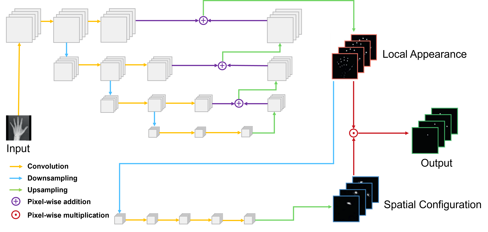
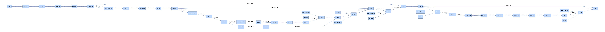
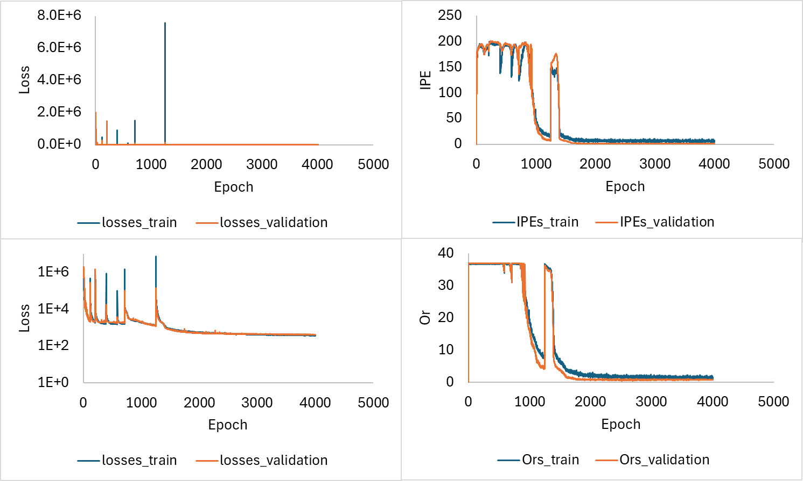

# SpatialConfiguration-Net for hand bone joints labeling using PyTorch

    

This model is inspired by the paper [Integrating spatial configuration into heatmap regression based CNNs for landmark localization](https://www.sciencedirect.com/science/article/pii/S1361841518305784).

---

## Model

SpatialConfiguration-Net comprises two components: one delivers locally accurate but potentially ambiguous candidate predictions, and the other incorporates spatial configuration to improve robustness against landmark misidentification by eliminating ambiguities.

The architecture of these two interacting components is flexible. This implementation follows a specific architecture, as shown below. I understand that this image might not be large enough to display the entire architecture clearly, so please download it and zoom in for a better view.

    

### Local Appearance Component

This component has four levels, each consisting of three consecutive 5×5 convolutional layers with 64 outputs. After the second convolutional layer, a 2×2 average pooling generates the level below. Dropout with a probability of 0.5 is applied after the first convolutional layer at each level to improve generalization. The local appearance heatmaps are generated from a 5×5 convolutional layer with a number of outputs equal to the number of landmarks (37).

### Spatial Configuration Component

This component operates at 1/8 of the input resolution and consists of three consecutive 15×15 convolutional layers with 64 outputs, followed by an additional 15×15 convolutional layer with a number of outputs equal to the number of landmarks (37). The outputs are upsampled back to the input resolution using bi-cubic interpolation.

Each intermediate convolution layer of the entire network has a LeakyReLU activation function with a negative slope of 0.1. However, the convolution layer generating the local appearance output uses a linear activation function, and the last convolution layer generating the spatial configuration output uses a TanH activation function to restrict the outputs between -1 and 1.

The biases of the convolutional layers are initialized to 0, and the weights are initialized using the Kaiming method.

Ridge Regression is used, and the loss function follows Eq. (2) in the [original SpatialConfiguration-Net paper](https://www.sciencedirect.com/science/article/pii/S1361841518305784), excluding the term penalizing the standard deviation controlling the heatmap peak width.

## Data

A subset of hand radiographs from the [Image Processing and Informatics Lab](https://ipilab.usc.edu/research/baaweb/) is used to demonstrate a use case. All of these images are contained in the `dataset` folder.

- 91 images are used for the training dataset.
- 21 images are used for the validation dataset.
- 21 images are used for the test dataset.

### Data Preprocessing

Data preprocessing includes:

- Resizing images to 256x256.
- Performing histogram matching to a reference image solely within the hand outline computed by Otsu thresholding.
- Transforming coordinates into 256x256 heatmaps using a Gaussian function.

### On-the-Fly Data Augmentation

On-the-fly data augmentation includes:

- Intensity range scaling and shifting.
- Image translation, rotation, and scaling.
- Elastic deformations.

## Experiments

Model performance on hand bone joint labeling is evaluated by the average Euclidean distances between predicted and corresponding target landmarks (IPE). Another evaluation metric is the number of outliers outside a given radius (Or), as described by [Payer et al. (2019)](https://www.sciencedirect.com/science/article/pii/S1361841518305784).

Using the Adam optimizer with a learning rate of 0.0001, a first moment of 0.5, and a second moment of 0.999, the loss, IPE, and Or variation with respect to epochs are as follows:

    

The best model obtained achieves an IPE of 1.125 and an Or (radius = 10 pixels) of 0.5238 on the test dataset.

If a linear decay of the learning rate is applied, the model performance is as follows:

    

The best model obtained achieves an IPE of 1.262 and Or (radius = 10 pixels) of 0.6667 on the test dataset.

## Usage

Running `data_preprocessing.py` will start the preprocessing, and running `main.py` will start training, validation, and testing. Many print and save operations are available during the training and validation process, although most are commented out in `solver.py` for computational efficiency.

